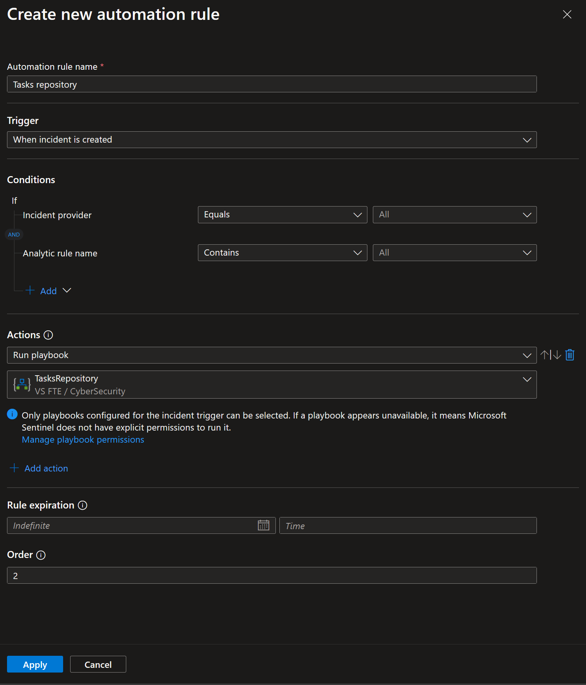
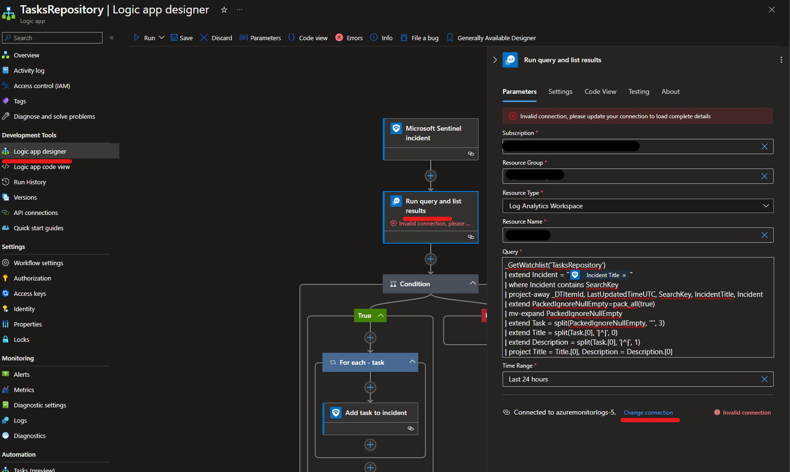
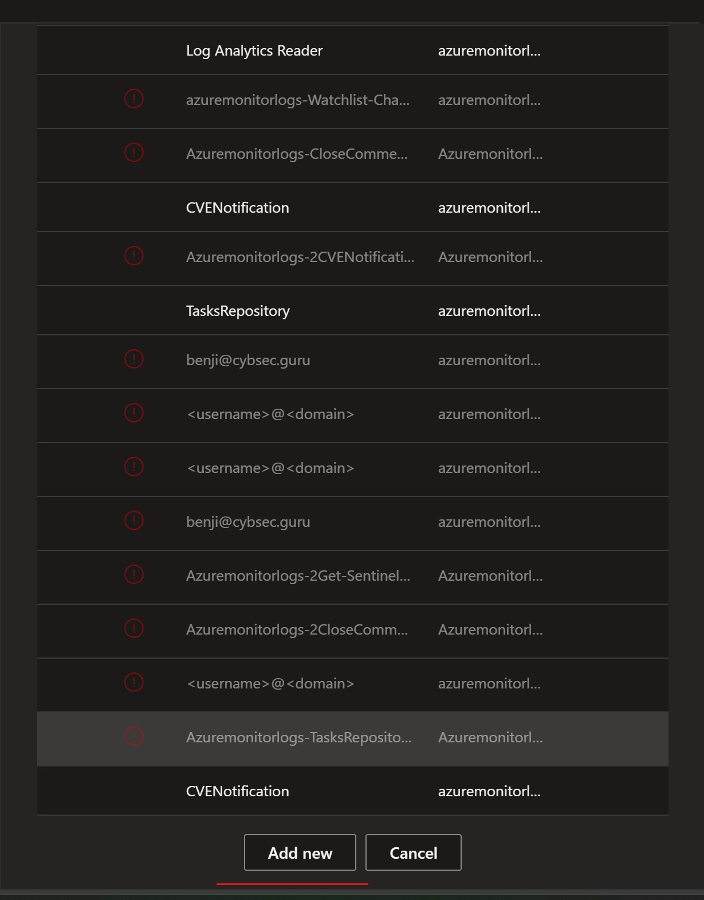
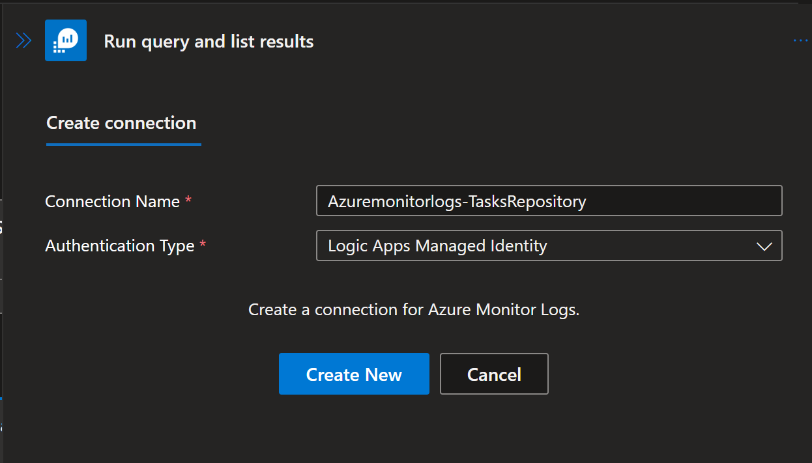

# Tasks-Repository
author: Benji Kovacevic

This solution contains Tasks Repository Watchlist and Playbook that are used to assign tasks automaticlly based on incident title.  
This solution is explained in details in this blog - <a href="https://techcommunity.microsoft.com/t5/microsoft-sentinel-blog/create-tasks-repository-in-microsoft-sentinel/ba-p/4038563">Create Tasks Repository in Microsoft Sentinel</a>.

# Prerequisites
Permissions
1.	Watchlist: 
Permission needed to deploy: Microsoft Sentinel Contributor
2.	Playbook: 
Permission needed to deploy: Logic App Contributor 
Permission needed to assign RBAC to managed identity: User Access Administrator or Owner on Resource Group where Microsoft Sentinel is
3.	Automation rule: 
Permission needed to create: Microsoft Sentinel Responder

# Quick Deployment
1. Deploy Tasks Repository watchlist using ARM template 

, or using <a href="https://github.com/Azure/Azure-Sentinel/blob/master/Tools/Tasks-Repository/TasksRepository.csv">raw CSV file</a> and following instructions on how to <a href="https://learn.microsoft.com/azure/sentinel/watchlists-create">create watchlist manually</a>.
 
<strong>Note:</strong> 
When creating watchlist manually, use TasksRepository for alias, or this field will need to be updated in the playbook after deploying it. Also, map SearchKey to IncidentTitle column as playbook is using it as well.

2. Deploy a playbook 

  

3. Final step is to create an automation rule that will run on incident creation on all incidents, and as an action will run playbook.

- Title: Tasks repository 
- Trigger: When incident is created 
- Actions: Run playbook -> TasksRepository 

 

# Post-deployment
1. Assign Microsoft Sentinel Responder role to the managed identity. To do so, choose Identity blade under Settings of the Logic App.
2. Open Edit mode of the playbook, and add managed identity to Azure Monitor Logs action
 
 
For Connection Name enter: Azuremonitorlogs-TasksRepository 
For Authentication Type choose: Logic Apps Managed Identity 
 
Select Create New, and then Save the playbook. 
3. Add tasks to the Tasks Repository watchlist.
<strong>Note</strong>: 
When adding additional tasks, there is a format that should be used so that playbook can map tasks title and description field. Each tasks filed should look like Tasks title, unique separator |^|, followed by Tasks description. Unique separator |^| is used in playbook to separate title and description of the tasks into its appropriate fields. In watchlist example, in column Task01 we can see example - Task 1|^|Task description.
