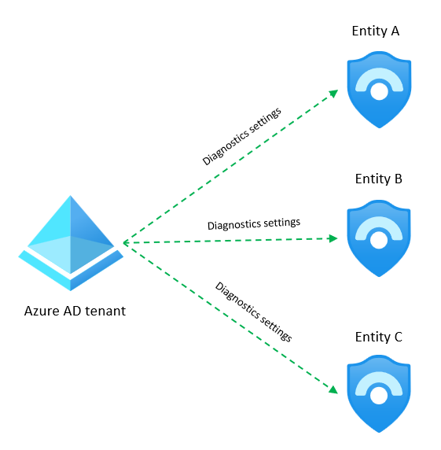

# Filtering at ingestion time

Filtering incoming logs is essential to avoid noise in our telemetry and to keep ingestion costs under control.

In this folder we have two examples on how to achieve filtering: dropping fields (FilteringFieldsDCR.json) or entire rows (FilteringRowsDCR.json).

## Dropping fields

This is about removing fields that don't add any value to our security operations. The way to achieve this in transformKql is very simple:

```
source 
| project-away Version, InterfaceId
```

Just using ```project-away``` will avoid ingesting the specified fields into the workspace. Take into account that the column will not disappear, but field will be empty, avoiding the ingestion cost.

Deploy this DCR:

[](https://portal.azure.com/#create/Microsoft.Template/uri/https%3A%2F%2Fraw.githubusercontent.com%2FAzure%2FAzure-Sentinel%2Fmaster%2FTools%2FTransformations-Library%2FFiltering%2FFilteringFieldsDCR.json)

## Dropping fields just for some vendors or devices

There are tables in Sentinel that can hold data coming from multiple devices or vendors. For example, CEF table (CommonSecurityLog) can get data from different device types (firewalls, proxies, etc.) and vendors (Palo Alto, Fortinet, Checkpoint, etc.). If we need to drop fields in those cases, we normally need to do it by vendor or device, for example, drop the *DeviceFacility* field for Palo Alto, but leave it untouched for others.

To achieve this in transformKql, we can use the following approach:

```
source
| extend DeviceFacility = iif(DeviceVendor in~ ('Palo Alto Networks','Fortinet'),'', DeviceFacility), 
```

In this example, we extend the *DeviceFacility* field and we assign an empty string if the *DeviceVendor* is Palo Alto or Fortinet.

[](https://portal.azure.com/#create/Microsoft.Template/uri/https%3A%2F%2Fraw.githubusercontent.com%2FAzure%2FAzure-Sentinel%2Fmaster%2FTools%2FTransformations-Library%2FFiltering%2FFilteringFieldsByVendorDCR.json)

## Dropping rows

This is about discarding entire rows (records) when certain conditions are met. Example:

```
source | where Action contains 'REJECT'
```

In this example we're using a table with firewall traffic information, where we just want to keep records where the action taken by the firewall was to reject the traffic. We use ```where``` clause to do that.

Deploy this DCR:

[](https://portal.azure.com/#create/Microsoft.Template/uri/https%3A%2F%2Fraw.githubusercontent.com%2FAzure%2FAzure-Sentinel%2Fmaster%2FTools%2FTransformations-Library%2FFiltering%2FFilteringRowsDCR.json)

## Multiple workspaces for independent entities

There are situations where you have multiple Sentinel workspaces, each owned by an independent entity. In those case, customers want each entity to see only its logs and not logs from other entities. This is ok for most data sources, but it can be a challenge for tenant-level sources like Office 365 or Azure AD.

For these situations, you can multi-home the data source (eg. Office365) to send to multiple workspace, and then filter out at ingestion time the data that doesn't belong to the entity. For this to be done successfully, you need to have something in the event that can determine the owning entity, like a different domain or a country code.



In this case, you would need to apply a filtering transformation in the default DCR of all workspaces involved. Each transformation would look something like this (replacing country name):

```kusto
OfficeActivity | where OrganizationName == 'contoso-<country_name>.onmicrosoft.com'
```

This will of course vary for each implementation and data type, but this gives an idea on how to do it.
