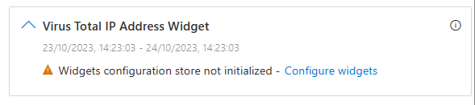
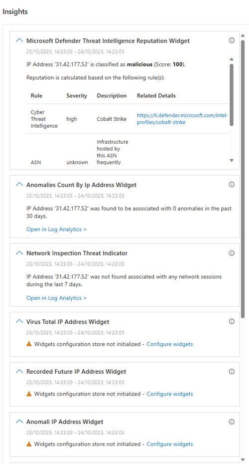

# Visualize data with enrichment widgets

In the fast-moving, high-pressure environment of your Security Operations Center, data visualization is one of your SIEM's key capabilities to help you quickly and effectively find usable information within the vast sea of data that constantly confronts you. Microsoft Sentinel uses widgets, the latest evolution of its data visualization capabilities, to present you with its most relevant findings.

Widgets are already available in Microsoft Sentinel today. They currently appear for IP entities, both on their full entity pages and on their entity info panels that appear in Incident pages. These widgets
show you valuable information about the entities, from both internal and third-party sources.

**What makes widgets essential in Microsoft Sentinel:**

- Real-time Updates: In the ever-evolving cybersecurity landscape, real-time data is of paramount importance. Widgets provide live updates, ensuring that your analysts are always looking at the most recent data.

- Integration: Widgets are seamlessly integrated into Microsoft Sentinel data sources, drawing from their vast reservoir of logs, alerts, and intelligence. This integration means that the visual insights presented by widgets are backed by the robust analytical power of Microsoft Sentinel.

In essence, widgets are more than just visual aids. They are powerful analytical tools that, when used effectively, can greatly enhance the speed and efficiency of threat detection, investigation, and response.

## Enable enrichment widgets

Widgets regularly access and maintain connections with their data sources. Generally, widgets require credentials to do so. These credentials can be in the form of API keys, username/password, or other secrets, and they are stored in a dedicated Azure Key Vault that you create for this purpose.

You must have the **Contributor** role for the workspace's resource group to create this Key Vault in your environment.

Microsoft Sentinel has automated the process of creating a Key Vault for enrichment widgets. To enable the new widgets experience, take the following two steps:

1. **Create a dedicated Key Vault to store credentials.**

   1. From the Microsoft Sentinel navigation menu, select **Entity behavior**.

   1. On the **Entity behavior** page, select **Enrichment widgets (preview)** from the toolbar.

      

   1. On the **Widgets Onboarding Page**, select **Create Key Vault**.  
      You will see an Azure portal notification when the Key Vault deployment is in progress, and again when it has completed.

2. **Add relevant credentials to your widgets' Key Vault.**

   The data sources accessed by all the available widgets are listed on the **Widgets Onboarding Page**. You need to add their credentials individually. To do so, take the following steps for each data source:

   

   1. Select the **Find your credentials** link for a given data source. This will redirect you to [specific instructions](#configure-individual-widgets) for finding or creating credentials for that data source. When you have the credentials, copy them aside and proceed to the next step.

   1. Select **Add credentials** for that data source. The **Custom deployment** wizard will open in a side panel on the right side of the page.  
   The **Subscription**, **Resource group**, **Region**, and **Key Vault name** fields are all pre-populated, and there should be no reason for you to edit them.

   1. Enter the credentials you saved into the relevant fields in the **Custom deployment** wizard (**API key**, **Username**, **Password**, and so on).

   1. Select **Review + create**.

Note: Not all widgets require special credentials.

## Add new widgets when they become available

Microsoft Sentinel aspires to offer a broad collection of widgets, making them available as they are ready. As new widgets become available, their data sources will be added to the list on the Widgets
Onboarding Page, if they aren't already there. When you see announcements of newly available widgets, check back on the Widgets Onboarding page for new data sources that don't yet have credentials configured. To configure them, follow step 2 above.

## Remove the widgets experience

To remove the widgets experience from Microsoft Sentinel, simply delete the Key Vault that you created in step 1 above.

## Configure individual widgets

### Find your credentials for Virus Total

1. Enter the **API key** defined in your Virus Total account. You can [sign up](https://aka.ms/SentinelWidgetsRegisterVirusTotal) for a free Virus Total account to get an API key.

1. After you select **Review + create** and deploy the template (see step 2d [above](#enable-enrichment-widgets)), a secret named "Virus Total" will be added to your key vault.

### Find your credentials for AbuseIPDB

1. Enter the **API key** defined in your AbuseIPDB account. You can [sign up](https://aka.ms/SentinelWidgetsRegisterAbuseIPDB) for a free AbuseIPDB account to get an API key.

1. After you select **Review + create** and deploy the template (see step 2d [above](#enable-enrichment-widgets)), a secret named "AbuseIPDB" will be added to your key vault.

### Find your credentials for Anomali

1. Enter the **username** and **API key** defined in your Anomali account.

1. After you select **Review + create** and deploy the template (see step 2d [above](#enable-enrichment-widgets)), a secret named "Anomali" will be added to your key vault.

### Find your credentials for Recorded Future

1. Enter your Recorded Future **API key**. Contact your Recorded Future representative to get your API key. You can also [apply for a 30-day free trial especially for Sentinel users](https://aka.ms/SentinelWidgetsRegisterRecordedFuture).

1. After you select **Review + create** and deploy the template (see step 2d [above](#enable-enrichment-widgets)), a secret named "Recorded Future" will be added to your key vault.

### Find your credentials for Microsoft Defender Threat Intelligence (MDTI)

1. The MDTI widget should fetch the data automatically if you have the relevant MDTI license. There is no need for credentials.

1. You can check if you have the relevant license, and if necessary, purchase it, at the MDTI official [website](https://www.microsoft.com/en-us/security/business/siem-and-xdr/microsoft-defender-threat-intelligence).

## FAQ

1. **The widget has not been configured:**

    If you received in a widget the message "The widget has not been configured" (see the following screenshot), make sure that you followed the instructions in the [Enable enrichment widgets](#enable-enrichment-widgets) section above.

    

1. **Failure to create the Key Vault:**

    If you get an error regarding the Key Vault deployment, it could be for several reasons:

    - You don't have the **Contributor** role in your environment.

    - Your subscription is not registered to the Key Vault resource provider.

1. **Failure to deploy the widget's data source secrets:**

    - You mistyped when entering the source credentials.

    - The provided ARM template has changed.

## Next steps

**View your widgets in the IP entity page**

To view your widgets:

- Select your Microsoft Sentinel workspace.

- Select **Entity behavior** from the navigation menu.

- Your widgets should be visible in the insights pane on the right side (see the following screenshot).

  
