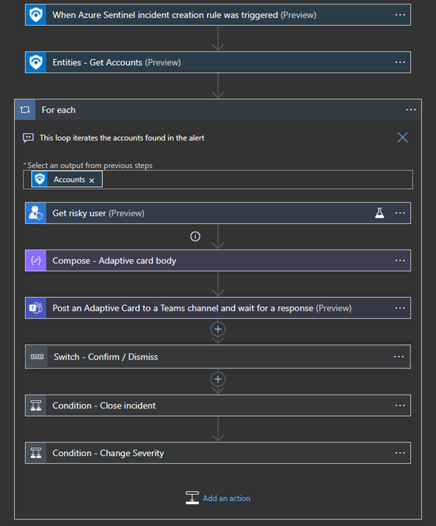

# Contribution guidelines

This document guides how to contirubte a playbook template to a **Microsoft Sentinel Solution** or to the **playbook templates tab**.
[See example.](https://github.com/Azure/Azure-Sentinel/tree/master/Playbooks/IdentityProtection-TeamsBotResponse)

# Main steps

Once you have created a playbook that you want to export to share, please follow the following guidelines:

1. [Playbook conventions and guidlines](#playbook-conventions-and-guidlines)
2. [Create ARM Template](#create-arm-template)
3. [Add metadata to the ARM Template](#add-metadata)
4. [Create Screenshots](#create-screenshots)
5. [Create Readme file](#create-readme-file) (For GitHub/Playbook templates tab contribution)<br>
6. [Create a Pull Request](#create-a-pull-request) (For GitHub/Playbook templates tab contribution)


## Playbook conventions and guidlines

* **Trigger choice:** please use **Microsoft Sentinel Incident** trigger, unless there is a strong use case for the alert trigger. [Learn more](https://docs.microsoft.com/azure/sentinel/playbook-triggers-actions#microsoft-sentinel-triggers-summary)
* **Use parameters**<br> For example, if playbook sends an email to the SOC shared inbox, this field should be supplied as a parameter to the playbook.To do so:
    * When you develop your playbook, [create a parameter](https://docs.microsoft.com/azure/logic-apps/create-parameters-workflows?tabs=consumption#define-use-and-edit-parameters) for such value.
    * Playbooks steps should use the parameters values. 
    * When [templatizing](#Create-ARM-Template) the playbook, create an ARM template parameter which gets, in deployment time, the user input, and refer the workflow parameter to get it.
* **Use connector best practices:** Use [this doc to see common best practices](https://docs.microsoft.com/azure/sentinel/playbook-triggers-actions).
* **Testing** Please test your playbook end to end with variety of scenarios.

## Create ARM Template

ARM template allow you to specify the resources to deploy and the properties for those resources. For Playbooks, ARM template will include to following resources:
* **Logic Apps workflow** - This is where the playbook logic is described. 
* **API connections** - For each connector in this playbook, there should be an API connection resource.
<br><br>

1. **Generate the initial ARM template** which you will adapt in the following steps.<br>
Start with copy this [reference template](https://github.com/Azure/Azure-Sentinel/blob/master/Playbooks/.template/incident-trigger/azuredeploy.json) to a new empty file under your JSON editor (such VS code or Notepad ++).
    <br>Make the following editing, using **Logic Apps code view** of your playbook:
    * Replace **actions**  section with **actions** section of your doc.
    * Add to **$connections** the connections which are not *azuresentinel*.

    <br>
    Other ways to generate a template (but note this guide refers to the initial ARM template mentioned above):

    * Generate a template using [this script](https://github.com/Azure/Azure-Sentinel/tree/master/Tools/Playbook-ARM-Template-Generator).
    * In the left menu, click on **Export Template** of the Logic Apps resource.

<br>

2. **Parameters section**<br>
This part should include:
    * Playbook name: Name of the Logic Apps resource to be created
    * User input parameters which adapt this playbook to the unique customer environment and populate in the workflow.<br>
     These parameters should appear twice: In the parameters section and in the workflow resources.<br>
     Under the "resources" list, find an element with "type": "Microsoft.Logic/workflows" -> definition -> parameters.
<br>
Example for ARM template parameters:

```json
    "parameters": {
        "PlaybookName": { // Mandatory. This will be the resource name for the playbook when created from wizard. (If there are nested playbooks, this should be the parent)
            "defaultValue": "IdentityProtectionResponseFromTeams",
            "type": "String",
            "metadata": {
                "description": "Name of the Logic Apps resource to be created"
            }
        },

        // For example:
        "SocEmailAddress": {
            "defaultValue": "Email will be sent to this address by this playbook.",
            "type": "string"
            },
        
        ... // more parameters required to this playbook
    },
```
Example for workflow level parameters *Note that the "defaultValue" refer the parameter's name defined above*
```json
        "SocEmailAddress": {
            "defaultValue": "[parameters('SocEmailAddress')]",
            "type": "String"
        }
    },
```


3. **Variables and DependsOn sections**<br>Create a variable for each connection the playbook is using.<br>
    The template already contains Microsoft Sentinel variable:
    ```json
        "variables": {
            "AzureSentinelConnectionName": "[concat('azuresentinel-', parameters('PlaybookName'))]",
        },
        
    ```

    To construct a string variable for the other connectors, use the following snippet. Make sure to replace the `uniqueName` with the actual name of the connector.

    For example:

    ```json
        "variables": {
            "{uniqueName}ConnectionName": "[concat('{uniqueName}', parameters('PlaybookName'))]"
            ... // other connections
        },
        
    ```
    In addition, for each variable, you need to add an entry in the "dependsOn" parameter under: "Microsoft.Logic/workflows" resource.
    You can use the below snippet and replace "{variableName}" with the variable name you've chosen above:
    ```
        "dependsOn": [
            "[resourceId('Microsoft.Web/connections', variables({variableName}))]",
        ]
    ```
    Please note the template already contains an entry for Microsoft Sentinel, so you only need to append the rest (if such exists).

    You can find a list of the connections under: 
    1. Go to the playbook you are creating this template for -> click on "Logic add code view"
    2. Under "parameters" -> "$connections" -> "value" <br>
    For example:

    ```json
    "parameters": {
        "$connections": {
            "value": {
                "azuresentinel": {
                    "connectionId": "/subscriptions/{subsriptionId}/resourceGroups/{resourceGroups}/providers/Microsoft.Web/connections/azuresentinel",
                    "connectionName": "azuresentinel",
                    "id": "/subscriptions/{subsriptionId}/providers/Microsoft.Web/locations/{locations}/managedApis/azuresentinel"
                }
            }
        }
    }
    ```
    Note: if there are duplicates, create only one variable for each connection.

4. **Create a resource for each connection**<br>
Note: Microsoft Sentinel connection should include:  

```
"parameterValueType": "Alternative",
```
All ARM template needs to contain the following resource, so please copy and paste it into your file:

```Json
        "resources": [
        {
            "type": "Microsoft.Web/connections",
            "apiVersion": "2016-06-01",
            "name": "[variables('AzureSentinelConnectionName')]",
            "location": "[resourceGroup().location]",
            "kind": "V1",
            "properties": {
                "displayName": "[variables('AzureSentinelConnectionName')]",
                "customParameterValues": {},
                "parameterValueType": "Alternative",
                "api": {
                    "id": "[concat('/subscriptions/', subscription().subscriptionId, '/providers/Microsoft.Web/locations/', resourceGroup().location, '/managedApis/azuresentinel')]"
                }
            }
        },
```
Copy the snippet below and modify **{variableName}** with the variable name given in step 2. In addition, you need to replace **{uniqueConnectionName}** with the connection name.
You can find the connection name in the same way you can find the connections list in step 3.<br>
The connection name appears at the end of each connection's **id** value.

```Json
        {
            "type": "Microsoft.Web/connections",
            "apiVersion": "2016-06-01",
            "name": "[variables('{variableName}')]",
            "location": "[resourceGroup().location]",
            "properties": {
                "displayName": "[variables('{variableName}')]",
                "customParameterValues": {},
                "api": {
                    "id": "[concat('/subscriptions/', subscription().subscriptionId, '/providers/Microsoft.Web/locations/', resourceGroup().location, '/managedApis/{uniqueConnectionName}')]"
                }
            }
        }
```
<br>

Example references:
* [AAD](https://github.com/Azure/Azure-Sentinel/blob/master/Playbooks/Block-AADUser/incident-trigger/azuredeploy.json#L31)
* [Office 365](https://github.com/Azure/Azure-Sentinel/blob/master/Playbooks/Block-AADUser/incident-trigger/azuredeploy.json#L60)
* [Microsoft Teams](https://github.com/Azure/Azure-Sentinel/blob/master/Playbooks/Post-Message-Teams/azuredeploy.json#L37)
<br>

    
### Following adaption required under **Microsoft.Logic/workflows**  resource
<br>


5. **Hidden tags** (Only for playbook templates tab)
<br>Please include the following hidden tags with a unique, no-space playbook identifier name, and first version number: <br>
    ```Json
                "type": "Microsoft.Logic/workflows",
                "apiVersion": "2017-07-01",
                "name": "[parameters('PlaybookName')]",
                "location": "[resourceGroup().location]",
                "tags": {
                    "hidden-SentinelTemplateName": "IdentityProtectionResponseFromTeams",
                    "hidden-SentinelTemplateVersion": "1.0"
                },
    ```

6. **$connections**<br>
Under **$connections**, copy from your template any connection which is not azuresentinel. Make sure it is not hardcoded. Example:

    ```json
    "parameters": {
                        "$connections": {
                            "value": {
                                "azuread": {
                                    "connectionId": "[resourceId('Microsoft.Web/connections', variables('AzureADConnectionName'))]",  //using the variable we created 
                                    "connectionName": "[variables('AzureADConnectionName')]",  //using the variable we created 
                                    "id": "[concat('/subscriptions/', subscription().subscriptionId, '/providers/Microsoft.Web/locations/', resourceGroup().location, '/managedApis/azuread')]" // same string we used to create the resource
                                },

                                "azuresentinel": {
                                    "connectionId": "[resourceId('Microsoft.Web/connections', variables('AzureSentinelConnectionName'))]",
                                    "connectionName": "[variables('AzureSentinelConnectionName')]",
                                    "id": "[concat('/subscriptions/', subscription().subscriptionId, '/providers/Microsoft.Web/locations/', resourceGroup().location, '/managedApis/azuresentinel')]",
                                    "connectionProperties": {
                                        "authentication": {
                                            "type": "ManagedServiceIdentity"
                                        }
                                    }
                                }
                    }
    ```

8. **Test deployment of your template** following [Instructions for deploying a custom template](https://github.com/Azure/Azure-Sentinel/tree/master/Playbooks#instructions-for-deploying-a-custom-template). <br>
**Make sure the deployment succeeds.**


## Add Metadata

Please add to the ARM Template the following metadata.
Fields marked with * are mandatory. Others can be left empty.

```
  title: string; // 
  description: string;
  prerequisites?: string | string[];
  prerequisitesDeployTemplateFile?: string;
  lastUpdateTime: string;
  entities?: string[];
  tags?: string[],
  support: { tier: string; link?: string };
  author: { name: string };
  ```

* ***title** (string)<br>
    Indicates the main goal of this playbook. Identical to PlaybookName parameter, spaces allowed. 
* ***description:** (string, Markdown can be used for providing links)<br> 
    Few sentences that describe the playbook main steps and value.
* **prerequisites:** (array of strings, Markdown can be used for providing links)<br> 
    list of steps required to be taken before deploying this playbook or running it for the first time, such: configurations in other products or in Azure, permissions required for included connectors, deployments required as dependencies.
* **postDeploymentSteps:** (array of strings, Markdown can be used for providing links)<br>  
list of steps required to be taken after deploying this playbook and before running it for the first time, such: changes in Logic Apps designer, managed identities configuration, configurations in other products or in Azure.
* **entities:** (array of strings)<br> 
    If relevant, list the entity types that the playbooks is working on explicitly with "Entities - Get IPs/URLs/FileHashes/Hosts/Accounts" action or specific parsing. <br>
    Supported entities: "account",  "host",  "ip",  "url",  azureresource",  "cloudapplication",  "dnsresolution",  "file",  "filehash",  "hostlogonsession",  "iotdevice",  malware",  "networkconnection",  "process",  "registrykey",  "registryvalue",  "securitygroup",  "mailbox",  mailcluster",  "mailmessage",  "submissionmail"
* ***tags**: (array of strings)<br> 
    Use this field to relate the templates to a specific security scenario. <br>
    Examples: "Enrichment", "Notification", "Remediation", "Response from teams", "Sync", "Triage", "Utilities", "Identity protection", "Incident management".
     
    
Templates tab only:
* ***lastUpdateTime**:  (string, UTC)<br>
    UTC time when author created/updated the template (version of the template is described in the Workflow resource)
* **prerequisitesDeployTemplateFile:** (string, relative path)<br>
    If playbook has a deployment prerequisite in form of an ARM template located in GitHub, this path will provide a link to it. Ths link should be relative to the folder of this playbook in GitHub.    
* ***support**
    * **tier**: (string) <br>
    The support expectation for this playbook. "microsoft", "community" or "developer" (for ISV or vendor)
    * **link** (string)<br> 
    The playbooks gallery need this fiels only in case the support->tier is "developer". 
* ***author**: (string) <br>
    Name of the person who contributed the playbook.


```json
    "metadata":{
        "title": "Identity Protection response from Teams", 
        "description": "Run this playbook on incidents which contains suspiciouse AAD identities. When a new incident is created, this playbook iterates over the Accounts. It then posts an adaptive card in the SOC Microsoft Teams channel, including the potential risky user information given by Azure AD Identity Protection. The card offers to confirm the user as compromised or dismiss the compromised user in AADIP. It also allows to configure the Azure Sentinel incident. A summary comment will be posted to document the action taken and user information.",
        "prerequisites": "1. Using the riskyUsers API requires an Azure AD Premium P2 license. 2. Have a user which has permissions on Identity Protection API. [Learn more](https://docs.microsoft.com/graph/api/riskyuser-confirmcompromised?view=graph-rest-1.0#permissions)  3. (optional) Create policies in Azure AD Identity protection to run when users are confirmed as compromised. [Learn more](https://docs.microsoft.com/azure/active-directory/identity-protection/concept-identity-protection-policies)",
        "lastUpdateTime": "2021-05-18T10:00:15.123Z", 
        "entities": ["Account"], 
        "tags": ["Identity protection", "Teams bot"], 
        "support": {
            "tier": "microsoft"
        },
        "author": {
            "name": "Lior Tamir"
        }
    },
```


## Create screenshots
Meant to help the user understand the playbook functionality and value. 
The playbook folder should contain an "images" folder with screenshots of:
* **Logic Apps designer** (main steps, expand only interesting steps). <br>
Please take screenshots of dark and light Azure theme (can be configured from settings button in the top right Azure toolbar).
    <br>Example:<br>
* **Comments** this playbook posts on Azure Sentinel incident (optional)
    <br>Example:<br><br>
* **Changes on the other product** (optional)
* **Artifacts collected** (optional)


## Create Readme file 
(not required for Microsoft Sentinel Solution contribution) 
Readme file is meant to be used by users who deploy templates from GitHub. Should contain the details from the ARM template metadata:
* Title
* Description
* Prerequisites
* Author
* Screenshots

Additionally, should contain **Deploy To Azure** Button.

```markdown
# Playbook title
playbook description

## prerequisites
* prerequisite 1
* prerequisite 2 
* ...

screenshots:


## Deploy to Azure
locate here the deployment buttons (replace PlaybookFolderName)
```
```html
<a href="https://portal.azure.com/#create/Microsoft.Template/uri/https%3A%2F%2Fraw.githubusercontent.com%2FAzure%2FAzure-Sentinel%2Fmaster%2FPlaybooks%2F{PLAYBOOK_FOLDER_NAME}%2Fazuredeploy.json" target="_blank">
    
</a>
<a href="https://portal.azure.us/#create/Microsoft.Template/uri/https%3A%2F%2Fraw.githubusercontent.com%2FAzure%2FAzure-Sentinel%2Fmaster%2FPlaybooks%2F{PLAYBOOK_FOLDER_NAME}%2Fazuredeploy.json" target="_blank">

</a>

```

[Extended guidance for creating Azure Deploy button can be found here.](https://docs.microsoft.com/azure/azure-resource-manager/templates/deploy-to-azure-button)


## Create a pull request 
(not required for Microsoft Sentinel Solution contribution) 
Please locate the following files under a folder named by PlaybookName, which includes:
* azuredeploy.json ([ARM Template](#Create-ARM-Template))
* readme.md ([Readme file](#Create-Readme-file))
* images folder ([screenshots](#Create-screenshots) folder)
    * ImageDark1.png
    * ImageLight.png
    * ...

Please make sure ARM template is tested before submitting.
