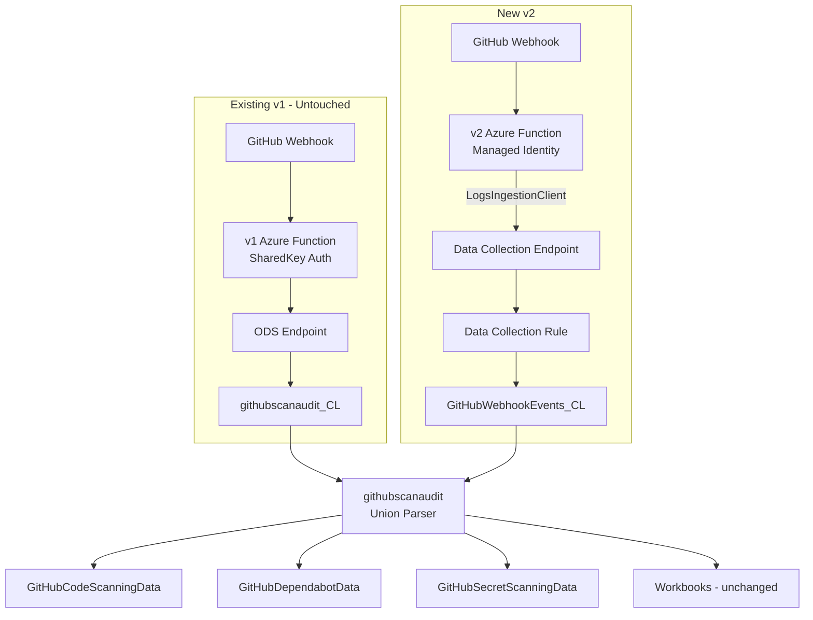

# GitHub Webhook Connector V2: CLv1 ODS → CLv2 Logs Ingestion API Migration Plan

## Executive Summary

Create a **new v2 connector** (`GithubWebhookV2`) alongside the existing v1, migrating from CLv1 HTTP Data Collector API (ODS) to CLv2 Logs Ingestion API (GIG). The v1 connector remains untouched — existing deployed Function Apps continue working.

### Key Decisions

| Decision | Choice | Rationale |
|---|---|---|
| **Approach** | New v2 connector side-by-side | Existing Function Apps not broken |
| **Table name** | `GitHubWebhookEvents_CL` (new) | Clean separation; union parser for unified view |
| **Column names** | Same `_s` suffixed names as CLv1 | Zero impact on workbooks, parsers, queries |
| **Authentication** | Managed Identity | No secrets to manage; `DefaultAzureCredential` |
| **Compatibility** | Union alias parser | Queries see both old + new data seamlessly |
| **Connector type** | Function App (GenericUI) | NOT a CCF connector |

---

## Architecture



### Why same column names?

The current `customizeJson()` function in v1 flattens nested objects into JSON strings, and CLv1 auto-appends `_s` suffixes. All downstream queries (55+ workbook queries, 3 parsers) reference these columns:

- `action_s`, `event_s`, `commit_oid_s`, `ref_s`, `ref_type_s`, etc. (scalar strings)
- `alert_s`, `repository_s`, `organization_s`, `sender_s`, etc. (JSON-encoded object strings)

The v2 connector will produce **identical column names and formats** — the `_s` suffixed column names will be explicitly defined in the CLv2 table schema, and the Function code will JSON-stringify nested objects the same way `customizeJson()` does. This means every existing KQL query works against the new table without modification.

---

## What Changes vs What Stays

### NEW files (created from scratch):

| File | Description |
|---|---|
| `Data Connectors/GithubWebhookV2/GithubWebhookConnectorV2/__init__.py` | CLv2 function code using `LogsIngestionClient` |
| `Data Connectors/GithubWebhookV2/GithubWebhookConnectorV2/function.json` | HTTP trigger binding (same as v1) |
| `Data Connectors/GithubWebhookV2/host.json` | Same as v1 |
| `Data Connectors/GithubWebhookV2/requirements.txt` | `azure-functions`, `azure-identity`, `azure-monitor-ingestion` |
| `Data Connectors/GithubWebhookV2/azuredeploy_GithubWebhookV2_API_FunctionApp.json` | ARM template with DCE, DCR, Table, Role Assignment |
| `Data Connectors/GithubWebhookV2/GithubWebhookV2_API_FunctionApp.json` | Connector definition (GenericUI) |
| `Data Connectors/GithubWebhookV2/GithubWebhookConnectorV2.zip` | Deployable Function App package |
| `Data Connectors/GithubWebhookV2/README.md` | Documentation |

### MODIFIED files (minimal changes):

| File | Change |
|---|---|
| `Parsers/GitHubCodeScanningData.yaml` | Change `githubscanaudit_CL` → `githubscanaudit()` function reference |
| `Parsers/GitHubDependabotData.yaml` | Same |
| `Parsers/GitHubSecretScanningData.yaml` | Same |
| `data/Solution_GitHub.json` | Add v2 connector to `Data Connectors` array; bump version |

### NEW parser file:

| File | Description |
|---|---|
| `Parsers/GitHubScanAudit.yaml` | Union alias: `githubscanaudit_CL` ∪ `GitHubWebhookEvents_CL` → `githubscanaudit()` |

### UNCHANGED files:

| File | Reason |
|---|---|
| `Data Connectors/GithubWebhook/*` (all v1 files) | v1 remains as-is |
| `Workbooks/GitHub.json` (~30 queries) | Queries `githubscanaudit_CL` directly — still works for v1 data |
| `Workbooks/GitHubAdvancedSecurity.json` (~25 queries) | Same |
| `Analytic Rules/*.yaml` | Reference `githubscanaudit_CL` — still works |
| `Hunting Queries/*.yaml` | Same |

> **Note**: Workbooks that query `githubscanaudit_CL` directly will only see v1 data. To see both old+new data, users switch to the `githubscanaudit()` parser. This can be updated in a follow-up to swap workbook queries to use the parser, or the workbook queries can be updated to `union githubscanaudit_CL, GitHubWebhookEvents_CL`.

---

## Detailed Implementation Steps

### Step 1: Create v2 Function App Code

**File**: `Data Connectors/GithubWebhookV2/GithubWebhookConnectorV2/__init__.py`

Based on the v1 code but replacing the ingestion layer:

**Keep from v1 (copy into v2):**
- HTTP trigger function structure
- GitHub webhook HMAC-SHA256 signature verification (`GithubWebhookSecret`)
- `customizeJson()` function (produces same column format — nested objects → JSON strings)
- `x-github-event` header extraction into `event` field

> **Shared code decision**: The HMAC webhook signature verification (~14 lines) and `customizeJson()` (~8 lines) are small, self-contained, and use only stdlib. **We will copy them into v2 rather than extracting a shared module.** Creating a shared module would require modifying v1's imports — which defeats the goal of leaving v1 untouched. The ~22 lines of duplicated code are a worthwhile tradeoff for zero risk to v1 deployments.

**Replace:**
- Remove: `build_signature()`, `post_data()`, `sentinel_customer_id`, `sentinel_shared_key`, `logAnalyticsUri`, ODS regex validation
- Remove: `import requests`, `import base64` (keep `hmac`/`hashlib` for webhook signature)
- Add: `DefaultAzureCredential`, `LogsIngestionClient`, `HttpResponseError`
- Add: env vars `DCE_ENDPOINT`, `DCR_RULE_ID`, `DCR_STREAM_NAME`

**New ingestion logic:**
```python
from azure.identity import DefaultAzureCredential
from azure.monitor.ingestion import LogsIngestionClient

dce_endpoint = os.environ.get('DCE_ENDPOINT')
dcr_rule_id = os.environ.get('DCR_RULE_ID')
dcr_stream_name = os.environ.get('DCR_STREAM_NAME')

credential = DefaultAzureCredential()
client = LogsIngestionClient(endpoint=dce_endpoint, credential=credential)

def post_data(body):
    client.upload(rule_id=dcr_rule_id, stream_name=dcr_stream_name, logs=[json.loads(body)])
```

**File**: `Data Connectors/GithubWebhookV2/requirements.txt`
```
azure-functions
azure-identity
azure-monitor-ingestion
```

**File**: `Data Connectors/GithubWebhookV2/GithubWebhookConnectorV2/function.json` — same as v1

**File**: `Data Connectors/GithubWebhookV2/host.json` — same as v1

---

### Step 2: Create v2 Table Schema

The table `GitHubWebhookEvents_CL` must have columns matching exactly what the `customizeJson()` function produces with `_s` suffixes. Based on the sample data analysis:

| Column Name | Type | Description |
|---|---|---|
| `TimeGenerated` | datetime | Auto-populated |
| `action_s` | string | Event action |
| `event_s` | string | x-github-event header value |
| `alert_s` | string | JSON string of alert object |
| `repository_s` | string | JSON string of repository object |
| `organization_s` | string | JSON string of organization object |
| `sender_s` | string | JSON string of sender object |
| `commits_s` | string | JSON string of commits array |
| `commit_oid_s` | string | Commit OID |
| `ref_s` | string | Git ref |
| `ref_type_s` | string | Ref type (tag, branch) |
| `rule_s` | string | JSON string of branch protection rule |
| `comment_s` | string | JSON string of comment object |
| `deployment_s` | string | JSON string of deployment object |
| `deployment_status_s` | string | JSON string of deployment status |
| `discussion_s` | string | JSON string of discussion object |
| `check_run_s` | string | JSON string of check run object |
| `key_s` | string | JSON string of deploy key |
| `changes_s` | string | JSON string of changes object |
| `master_branch_s` | string | Master branch name |
| `pusher_type_s` | string | Pusher type |
| `description_s` | string | Repo description |
| `number_d` | real | PR/Issue number |
| `forced_b` | boolean | Force push flag |

> The `_s`, `_d`, `_b` suffixes match CLv1 auto-naming. All string columns use type `string`; numeric fields use `real` (CLv1 `_d` suffix); booleans use `boolean` (CLv1 `_b` suffix).

This schema is defined as an ARM resource in the deployment template.

---

### Step 3: Create v2 ARM Template

**File**: `Data Connectors/GithubWebhookV2/azuredeploy_GithubWebhookV2_API_FunctionApp.json`

**Parameters:**
- `FunctionName` (default: `fngithubwebhookv2`)
- `WorkspaceResourceId` (full resource ID)
- `AppInsightsWorkspaceResourceID`
- `GithubWebhookSecret` (optional)

**Resources:**
1. **App Insights** — same as v1
2. **Storage Account** — same as v1
3. **Custom Log Table** (`Microsoft.OperationalInsights/workspaces/tables`)
   - Name: `GitHubWebhookEvents_CL`
   - Schema: columns from Step 2
4. **Data Collection Endpoint** (`Microsoft.Insights/dataCollectionEndpoints`)
5. **Data Collection Rule** (`Microsoft.Insights/dataCollectionRules`)
   - Stream: `Custom-GitHubWebhookEvents_CL`
   - streamDeclarations matching table columns
   - dataFlow: stream → logAnalytics destination
6. **Function App** (`Microsoft.Web/sites`)
   - `identity.type: SystemAssigned`
   - App settings: `DCE_ENDPOINT`, `DCR_RULE_ID`, `DCR_STREAM_NAME`, `GithubWebhookSecret`
   - No `WorkspaceID`/`WorkspaceKey`
7. **Role Assignment** (`Microsoft.Authorization/roleAssignments`)
   - Monitoring Metrics Publisher (`3913510d-42f4-4e42-8a64-420c390055eb`) on the DCR
   - Principal: Function App SystemAssigned identity
8. **Storage containers/file shares** — same as v1

---

### Step 4: Create v2 Connector Definition

**File**: `Data Connectors/GithubWebhookV2/GithubWebhookV2_API_FunctionApp.json`

Based on v1 but with:
- `id`: `GitHubWebhookV2`
- `title`: `GitHub (using Webhooks) V2`
- `graphQueries`/`dataTypes`/`connectivityCriterias`: reference `GitHubWebhookEvents_CL`
- `permissions`: remove `sharedKeys` requirement; add note about Managed Identity
- `instructionSteps`: updated Deploy to Azure button URL; no WorkspaceKey/WorkspaceID fields; add `WorkspaceResourceId` parameter
- Add deprecation note for v1 in description
- `metadata.version`: `1.0.0`

---

### Step 5: Create Union Alias Parser

**File**: `Parsers/GitHubScanAudit.yaml`

Following the pattern established by [`GitHubAuditData.yaml`](Solutions/GitHub/Parsers/GitHubAuditData.yaml) which unions `GitHubAuditLogPolling_CL` and `GitHubAuditLogsV2_CL`:

```yaml
id: <new-guid>
Function:
  Title: Parser for GitHubScanAudit - Union of v1 and v2 webhook tables
  Version: '1.0.0'
  LastUpdated: '2026-04-01'
Category: Microsoft Sentinel Parser
FunctionName: githubscanaudit
FunctionAlias: githubscanaudit
FunctionQuery: |
    union isfuzzy=true githubscanaudit_CL, GitHubWebhookEvents_CL
```

Since both tables have **identical column names** (`action_s`, `alert_s`, etc.), the union is trivial — no column renaming needed. `isfuzzy=true` handles the case where one table doesn't exist yet.

---

### Step 6: Update Existing Parsers (Optional but Recommended)

Update the three specialized parsers to query through the union alias instead of directly referencing `githubscanaudit_CL`:

**`Parsers/GitHubCodeScanningData.yaml`** — line 10:
```
githubscanaudit_CL  →  githubscanaudit
```

**`Parsers/GitHubDependabotData.yaml`** — line 10:
```
githubscanaudit_CL  →  githubscanaudit
```

**`Parsers/GitHubSecretScanningData.yaml`** — line 10:
```
githubscanaudit_CL  →  githubscanaudit
```

This is a single-line change in each parser. After this, the specialized parsers automatically see data from both v1 and v2 tables.

---

### Step 7: Update Solution Definition

**File**: `data/Solution_GitHub.json`

```json
"Data Connectors": [
    "Data Connectors/GitHubAuditLogs_CCF/GitHubAuditLogs_ConnectorDefinition.json",
    "Data Connectors/azuredeploy_GitHub_native_poller_connector.json",
    "Data Connectors/GithubWebhook/GithubWebhook_API_FunctionApp.json",
    "Data Connectors/GithubWebhookV2/GithubWebhookV2_API_FunctionApp.json"  // NEW
],
"Parsers": [
    "Parsers/GitHubAuditData.yaml",
    "Parsers/GitHubCodeScanningData.yaml",
    "Parsers/GitHubDependabotData.yaml",
    "Parsers/GitHubSecretScanningData.yaml",
    "Parsers/GitHubScanAudit.yaml"  // NEW
],
```

Bump `Version` to next minor.

---

### Step 8: Create v2 README

**File**: `Data Connectors/GithubWebhookV2/README.md`

Document:
- This is the CLv2 version using Logs Ingestion API
- Requires Managed Identity (no WorkspaceKey needed)
- Writes to `GitHubWebhookEvents_CL` table
- Data is compatible with existing parsers and workbooks via union alias
- How to disable v1 after migration
- Deploy to Azure button

---

### Step 9: Add Sample Data

Create new sample data file matching `GitHubWebhookEvents_CL` schema (same as current sample but with explicit column names matching the `_s` pattern).

---

### Step 10: Regenerate Package

```powershell
cd Tools/Create-Azure-Sentinel-Solution/V3
./createSolutionV3.ps1 -SolutionDataFolderPath "C:\repos\Azure-Sentinel\Solutions\GitHub\data" -VersionMode "local" -VersionBump "minor"
```

Verify the generated `Package/mainTemplate.json` includes both v1 and v2 connectors.

---

## New Directory Structure

```
Solutions/GitHub/Data Connectors/
├── azuredeploy_GitHub_native_poller_connector.json
├── GitHubAuditLogs_CCF/                        # Existing CCF connector
├── GithubWebhook/                              # Existing v1 - UNTOUCHED
│   ├── GithubWebhookConnector/
│   │   ├── __init__.py                         # CLv1 ODS code
│   │   └── function.json
│   ├── host.json
│   ├── requirements.txt
│   ├── azuredeploy_GithubWebhook_API_FunctionApp.json
│   ├── GithubWebhook_API_FunctionApp.json
│   ├── GithubWebhookConnector.zip
│   ├── README.md
│   └── Images/
└── GithubWebhookV2/                            # NEW v2
    ├── GithubWebhookConnectorV2/
    │   ├── __init__.py                         # CLv2 LogsIngestionClient code
    │   └── function.json
    ├── host.json
    ├── requirements.txt
    ├── azuredeploy_GithubWebhookV2_API_FunctionApp.json
    ├── GithubWebhookV2_API_FunctionApp.json
    ├── GithubWebhookConnectorV2.zip
    └── README.md
```

---

## Implementation Order

1. Create `GithubWebhookV2/GithubWebhookConnectorV2/__init__.py` — CLv2 function code
2. Create `GithubWebhookV2/GithubWebhookConnectorV2/function.json` — copy from v1
3. Create `GithubWebhookV2/host.json` — copy from v1
4. Create `GithubWebhookV2/requirements.txt` — new deps
5. Create `GithubWebhookV2/azuredeploy_GithubWebhookV2_API_FunctionApp.json` — ARM with DCE/DCR/Table/Role
6. Create `GithubWebhookV2/GithubWebhookV2_API_FunctionApp.json` — connector definition
7. Create `GithubWebhookV2/README.md`
8. Create `Parsers/GitHubScanAudit.yaml` — union alias parser
9. Update `Parsers/GitHubCodeScanningData.yaml` — table → function ref
10. Update `Parsers/GitHubDependabotData.yaml` — table → function ref
11. Update `Parsers/GitHubSecretScanningData.yaml` — table → function ref
12. Update `data/Solution_GitHub.json` — add v2 connector + new parser + version bump
13. Build `GithubWebhookConnectorV2.zip`
14. Run `createSolutionV3.ps1` to regenerate package
15. End-to-end testing

---

## Risk Assessment

| Risk | Severity | Mitigation |
|---|---|---|
| Workbooks only see v1 data when querying `githubscanaudit_CL` directly | Low | Documented; users can switch to `githubscanaudit()` parser; follow-up PR to update workbooks |
| Role assignment requires Owner/UAA permissions at deploy | Medium | Document in README |
| `createSolutionV3.ps1` handling of DCR/DCE ARM resources | Medium | Verify output; manual fix if needed |
| ZIP package hosting at aka.ms URL | Medium | Coordinate with team for new URL |
| Column name fidelity: v2 must exactly match v1 `_s`/`_d`/`_b` suffix pattern | Low | `customizeJson()` logic preserved; test with sample data |
