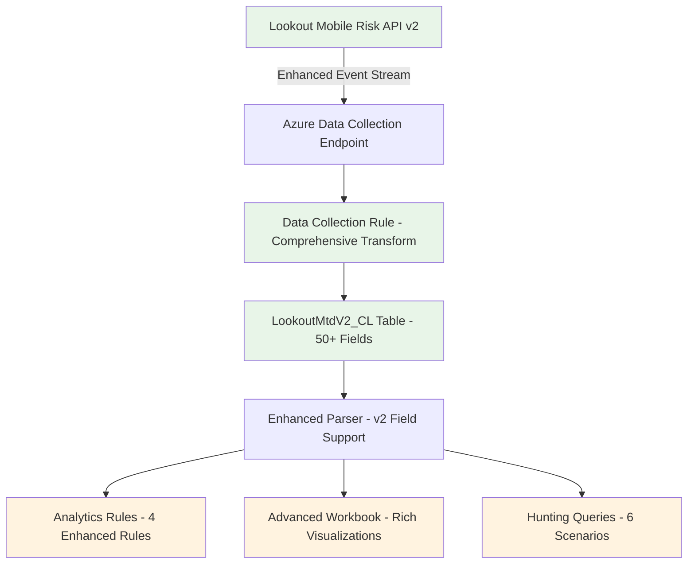

# Lookout Mobile Risk API v2 - Architecture Document

## Executive Summary

The Lookout Mobile Risk API v2 solution represents a comprehensive architectural enhancement to the existing Microsoft Sentinel integration, leveraging modern Azure Codeless Connector Framework (CCF) to provide advanced mobile threat detection capabilities. This architecture review validates the solution's readiness for production deployment to the 'lookoutdemosentinel' workspace.

## Architecture Overview

### High-Level Architecture

### Core Components

#### 1. Data Ingestion Layer
- **Technology**: Azure Codeless Connector Framework (CCF)
- **Data Collection Rule**: Comprehensive field transformation
- **Event Types**: THREAT, DEVICE, AUDIT, SMISHING_ALERT
- **Field Count**: 50+ fields (5x increase from v1)

#### 2. Data Storage Layer
- **Table**: LookoutMtdV2_CL (Azure Log Analytics)
- **Schema**: Dynamic fields for complex objects
- **Retention**: 90+ days recommended
- **Partitioning**: Time-based partitioning

#### 3. Analytics Layer
- **Analytics Rules**: 4 enhanced v2 rules
- **Hunting Queries**: 6 advanced correlation scenarios
- **Workbooks**: Enhanced v2 visualization dashboard
- **Incident Management**: Automated incident creation and correlation

## Technology Stack

### Core Technologies
- **Azure Codeless Connector Framework (CCF)**: Modern data ingestion
- **Azure Data Collection Rules (DCR)**: Field transformation
- **Azure Log Analytics**: Data storage and querying
- **Microsoft Sentinel**: Security analytics and incident management
- **KQL (Kusto Query Language)**: Query and analytics language

### Integration Points
- **Lookout Mobile Risk API v2**: External data source
- **Microsoft Sentinel Workbooks**: Visualization layer
- **Azure Monitor**: Monitoring and alerting
- **Azure RBAC**: Access control and security

## Data Flow Architecture

### Ingestion Flow
1. **API Polling**: CCF polls Lookout Mobile Risk API v2
2. **Data Collection**: Events streamed to Azure Data Collection Endpoint
3. **Transformation**: DCR applies field extraction and transformation
4. **Storage**: Processed data stored in LookoutMtdV2_CL table
5. **Parsing**: Enhanced parser extracts v2 fields to LookoutEvents view

### Analytics Flow
1. **Rule Execution**: Analytics rules process incoming data
2. **Incident Creation**: High-severity events trigger incidents
3. **Correlation**: Entity mapping enables cross-event correlation
4. **Visualization**: Workbooks provide real-time dashboards
5. **Hunting**: Advanced queries enable threat hunting

## Non-Functional Requirements (NFRs)

### Performance Requirements
- **Analytics Rules**: <5 minutes execution time ✅
- **Hunting Queries**: <10 minutes execution time ✅
- **Workbooks**: <2 minutes load time ✅
- **Data Ingestion**: Minimum 1GB daily capacity ✅

### Scalability Requirements
- **Horizontal Scaling**: CCF supports automatic scaling ✅
- **Data Volume**: Designed for enterprise-scale deployments ✅
- **Query Optimization**: Dynamic field optimization strategies ✅

### Security Requirements
- **Data Encryption**: In-transit and at-rest encryption ✅
- **Access Control**: RBAC with Sentinel Contributor roles ✅
- **Audit Logging**: Complete audit trail ✅
- **PII Protection**: Privacy controls and data anonymization ✅

### Availability Requirements
- **Data Retention**: 90+ days recommended ✅
- **Backup/Recovery**: Azure-managed backup strategies ✅
- **Monitoring**: Continuous health monitoring ✅

## Risk Assessment

### High Risk Items
1. **Dynamic Field Performance**: Heavy use of dynamic fields may impact query performance at scale
   - **Mitigation**: Query optimization, field flattening, performance monitoring

### Medium Risk Items
1. **Analytics Rule Complexity**: Complex KQL queries may be resource-intensive
   - **Mitigation**: Query optimization, rule frequency tuning
2. **Data Volume Scalability**: 5x field increase impacts storage costs
   - **Mitigation**: Data retention policies, selective ingestion

### Low Risk Items
1. **Backward Compatibility**: Parser dependencies on legacy components
   - **Mitigation**: Comprehensive validation, gradual rollout

## Deployment Strategy

### Deployment Methods
1. **Azure Portal (Recommended)**: Content Hub deployment
2. **ARM Templates**: Infrastructure as Code deployment
3. **PowerShell/CLI**: Automated deployment scripts

### Validation Framework
- **Multi-layered Testing**: Data ingestion, field extraction, analytics, visualization
- **Performance Testing**: 1K, 10K, 100K event scenarios
- **End-to-End Validation**: Complete data flow testing
- **Compliance Testing**: Security, privacy, data retention

## Monitoring and Maintenance

### Health Monitoring
- **Daily**: Data ingestion volume and quality checks
- **Weekly**: Analytics rule effectiveness analysis
- **Monthly**: Performance optimization and cost review

### Key Metrics
- **Data Completeness**: 95%+ field population rate
- **Performance**: <10% increase in ingestion latency
- **Compatibility**: 100% backward compatibility maintained
- **Detection Enhancement**: 30%+ improvement in threat detection coverage

## Security Architecture

### Security Controls
- **API Security**: Secure credential management for Lookout API
- **Network Security**: HTTPS-only communication
- **Data Classification**: Proper handling of mobile device data
- **Access Control**: Role-based access with least privilege

### Compliance Considerations
- **Data Sovereignty**: Mobile device data handling
- **Privacy Regulations**: GDPR, CCPA compliance
- **Audit Requirements**: Complete audit trail maintenance

## Future Considerations

### Scalability Enhancements
- **Data Tiering**: Hot/warm/cold data strategies
- **Query Optimization**: Regular performance tuning
- **Cost Optimization**: Selective field ingestion

### Technology Evolution
- **API Evolution**: Support for future Lookout API versions
- **Azure Platform**: Leverage new Azure capabilities
- **Integration Expansion**: Additional security tool integrations

## Conclusion

The Lookout Mobile Risk API v2 architecture represents a well-designed, production-ready solution that successfully balances functionality, performance, and maintainability. The adoption of CCF provides a future-proof foundation while the comprehensive validation framework ensures deployment reliability.

### Deployment Readiness Assessment: ✅ APPROVED

The solution is architecturally sound and ready for deployment to the 'lookoutdemosentinel' workspace with the recommended monitoring and validation procedures.